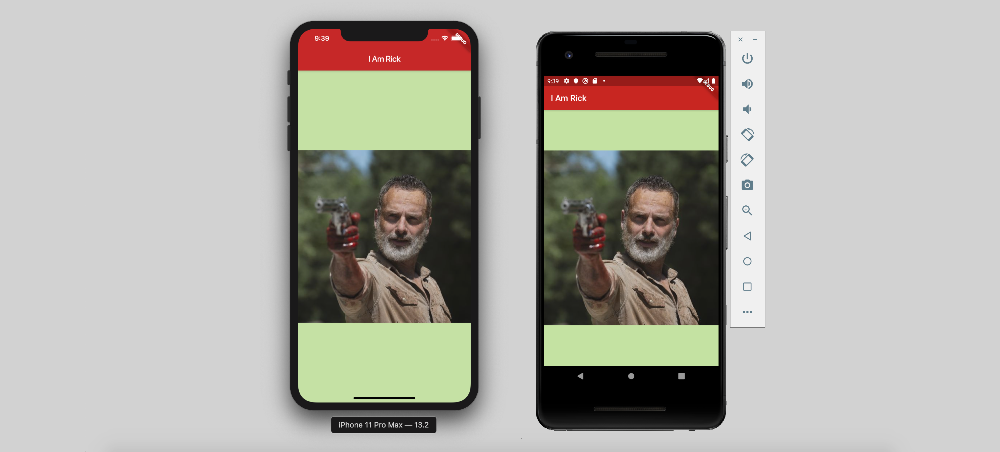
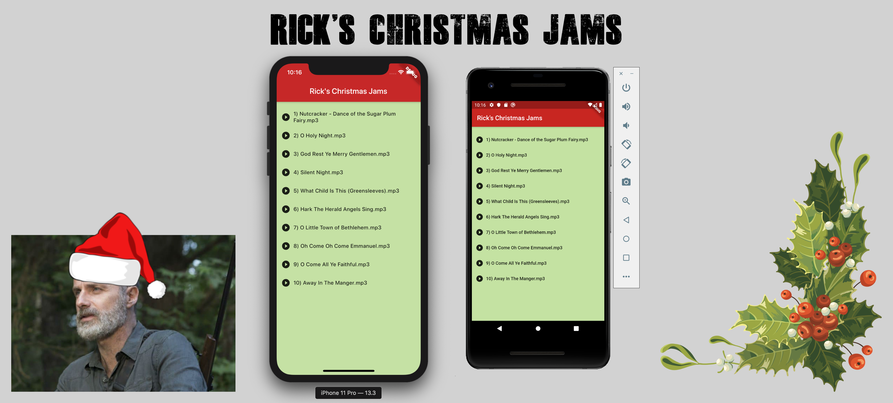
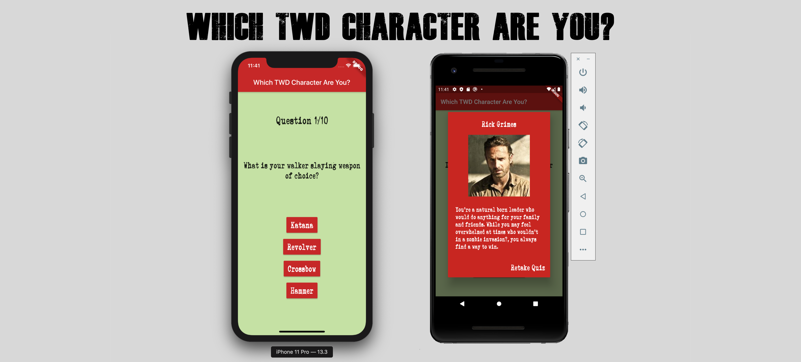

# I Am Rick

## Learning Flutter with Rick Grimes.

- **Episode 1**: A 'The Walking Dead' spinoff of the 'I Am Rich' app, made with Flutter. [[Medium story]](https://medium.com/@alexandrosbaramilis/i-am-rick-417d8b35ac0) [[Code]](https://github.com/alexbaramilis/I-Am-Rick/tree/master/Episode%201)

  
- **Episode 2**: Rick's Business Card. [[Medium story]](https://medium.com/@alexandrosbaramilis/i-am-rick-episode-2-74b6dd0e8642) [[Code]](https://github.com/alexbaramilis/I-Am-Rick/tree/master/Episode%202)

- **Episode 3**: Walker Takedown. [[Medium story]](https://medium.com/@alexandrosbaramilis/i-am-rick-episode-3-walker-takedown-b51fbde65bfa) [[Code]](https://github.com/alexbaramilis/I-Am-Rick/tree/master/Episode%203)

- **Episode 4**: Rick's Christmas Jams. [[Medium story]](https://medium.com/@alexandrosbaramilis/i-am-rick-episode-4-ricks-christmas-jams-dbe787a5f2f4?source=friends_link&sk=f15f3816a9bd21bcd05bfb7a95db1139) [[Code]](https://github.com/alexbaramilis/I-Am-Rick/tree/master/Episode%204)

- **Episode 5**: Which TWD Character Are You? [[Medium story]](https://medium.com/@alexandrosbaramilis/i-am-rick-episode-5-which-twd-character-are-you-8e36a4964662) [[Code]](https://github.com/alexbaramilis/I-Am-Rick/tree/master/Episode%205)

- **Bonus**: Setting up Flutter on macOS Catalina. [[Medium story]](https://medium.com/@alexandrosbaramilis/setting-up-flutter-on-macos-catalina-d023df8845ae)

